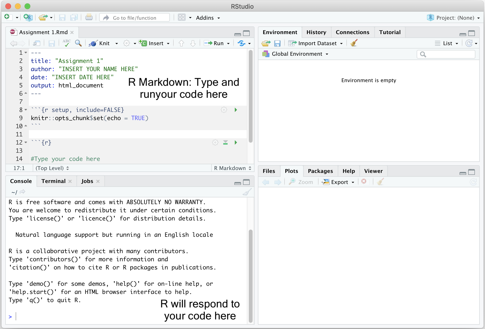

#### All credit goes to Noli Brazil and his [CRD 230 website](https://crd230.github.io/index.html) for this section

## R Scripts
Running R code using the console (bottom left in figure below) is a great place to start, but has its limitations. Each time you want to execute a set of commands, you have to re-enter them at the command line. Complex commands are potentially subject to typographical errors, necessitating that they be re-entered correctly. Repeating a set of operations requires re-entering the code stream. To give yourself more room to work, it’s a great idea to use the R script editor.

A script is simply a text file containing a set of commands and comments. The script can be saved and used later to re-execute the saved commands. The script can also be edited so you can execute a modified version of the commands.

You can open a new empty script by clicking the New File icon in the upper left of the main RStudio toolbar. This icon looks like a white square with a white plus sign in a green circle. Clicking the icon opens the New File Menu. Click the “R Script” option and the script editor will open with an empty script. Your R Studio should look similar to below (image source: [R for Data Science](https://r4ds.had.co.nz/workflow-scripts.html))

/


/

R Scripts are basically text files with a .R extension that houses your code and comments. You write your code. Execute that code from your R script. Results are produced in your R console window. In this class, we won’t be using regular R Scripts for homework assignments. Instead, we’ll be using [R Markdown](https://rmarkdown.rstudio.com/).

R Markdown documents take script files to a new level by allowing you to mix R commands with explanatory text. Think of an R Markdown document as an R script on steroids. Your R Markdown source document is compiled into an output report evaluating the R commands in the source document to produce easily reproducible results in an aesthetically pleasing form. It combines code, results from the code, and narrative text explaining the results to produce beautiful documents and academic reports.

Still not convinced that R Markdown is useful? Check out Nikhil Kaza’s thorough description of [why we should use R Markdown](https://nkaza.github.io/intro2Rbook/why-use-r-markdown.html).

## R Markdown

R Markdown is a simple formatting syntax for authoring html, pdf, and Microsoft Word documents in RStudio. For each R related assignment, you will upload onto Canvas two documents:

1. An R Markdown document, which has an .Rmd extension
1. A knitted `.html`, `.pdf` or `.docx` file

These documents will provide us an easy-to-read document to grade; more importantly, you will get to practice (1) writing scripts, (2) keeping track of the analyses you run, and (3) organizing your output in a reader-friendly manner. When you submit these documents on Canvas, **do not combine them into a zipped compressed folder**. They should be two separate files.

To be clear, R is a programming language. RStudio is an application. R Markdown is a markup syntax to convert R script and text into a pdf or html document. It allows for presentation-ready documents that show commands and results in a seamless flow. When you write R code and embed it in presentation documents created using R Markdown, you are forced to explicitly state the steps you took to do your research.

In RStudio, install the packages **knitr** and **rmarkdown** using the `install.packages()` command. Type the following in your RConsole window after `>`

```{r installpackages}
install.packages("knitr")
install.packages("rmarkdown")
```

Once you’ve installed these packages, you don’t need to install them any more in the future. You also do not need to load them in at any time using `library()`.

## Creating and saving an R Markdown

To create a new `.Rmd` file in RStudio, select File -> New File -> R Markdown. A window should pop up. Type in “Assignment 1” next to *Title* and your name next to *Author*r. Leave everything else alone and click OK. A new window in the top left of your RStudio console should pop up containing your new R Markdown file.



If you are using your personal computer for this guide, it’s best to set up a clean and efficient file management structure. File management is key to preventing R programming frustration. Here are some tips.

-Set up a clear and understandable hierarchical file system for this class on your hard drive. For example, create a class folder (SPH 215). Within this class folder, create the folder Assignments. Within the Assignments folder, create separate folders for each Assignment (e.g. Assignment 1, Assignment 2, …). Don’t work from your Desktop. Or from the Downloads folder. Or some randomly named folder that you will have a hard time finding a month, week or day from now. 
-Keep all your files that are related to a lab or assignment in one folder. That is, don’t have an Assignment 3 folder that contains data files specific to Assignment 1. Keep everything in one folder, including the R Markdown for that assignment or lab.

Using the basic guidelines above, save your R Markdown file into an appropriate folder on your hard drive by clicking on File and then Save from the RStudio menu.

To open an `.Rmd` file in RStudio, select File -> Open File and navigate to the folder you saved the assignment template in and select the file. You should see the R Markdown file pop up on the top left portion of your RStudio interface

/

## Authoring an R Markdown document

R Markdown documents contain 3 major components:

1. A YAML header surrounded by - - -
1. Chunks of R code surrounded by ```
1. Text mixed with simple text formatting using the Markdown syntax

### YAML header

The YAML header controls how R Markdown renders your `.Rmd` file. A YAML header is a section of key:value pairs surrounded by - - - marks and is always located at the top of your Rmd file.

In the assignment’s YAML, add your name, assignment number, and the date. These are the only necessary items, but you can change other options, most of which are detailed [here](https://bookdown.org/yihui/rmarkdown/html-document.html). Your YAML will generally look like the following.

```{yaml}
---
title: "Assignment [insert number here]"
subtitle: SPH 215
author: Your full name here
date: Assignment due date
output: 
  html_document:
    theme: cosmo
---

```

### R Code Chunks

When answering an assignment question, you’ll have the following sequence of components in your R Markdown document: Question, R code answering the question, comment describing what the code is doing, and your text to explain the results. Let’s say you have the following question in one of your assignments.

```{q1}
Question 1

1+1

1. What is the result of the operation above?
```

Assignments will ask you to write R code to accomplish a data analysis task. You present and execute your R code inside R code chunks. R chunks start with ```{r} and end with ```, and you insert your R code in between. To designate `1+1` as R code, it will look like the following in your R Markdown document.


```{rexample}
> ```{r}  
> 1+1 
> ``` 
```


All code inside a chunk will be executed when knitting the markdown file (i.e. the html file will show your code and its result). This means that your R code must reside inside an R code chunk in order for it to be processed as R code (otherwise R Markdown will think it is text). This also means that nothing but executable code (or comments, which we’ll get to next) should be inside a chunk.

We will ask you to annotate your R code so that we (and you) know what is being done in that line of code. You designate annotations or comments in R code using the `#` symbol. In programming, comments are bits of text that are not interpreted as computer instructions—they aren’t code, they’re just notes about the code! Since computer code can be opaque and difficult to understand, we use comments to help write down the meaning and purpose of our code. While a computer is able to understand the code, comments are there to help people understand it. This is particularly important when someone else will be looking at your work—whether that person is a collaborator, or is simply a future version of you (e.g., when you need to come back and fix something and so need to remember what you were even thinking).

Comments should be clear, concise, and helpful—they should provide information that is not otherwise present or “obvious” in the code itself. So, to annotate the above line of code `1+1`, you add in your R code chunk:

```{rexample}
> ```{r}  
> #this adds one plus one
> 1+1 
> ``` 
```

You put your comments after the `#`.

The first line of the chunk has `{r}` which basically states that everything inside the chunk will be in R code. Next to the `r`, we can give the chunk a name, such as:

```{rexample}
> ```{r q1chunk1}  
> #this adds one plus one
> 1+1 
> ``` 
```

Here, we named the chunk `q1chunk1` which indicates this is question 1, chunk 1. You can name the chunk whatever you like (jimbo, samantha, tony). The chunk name is not required; however, it is good practice to give each chunk a unique name (we’ll see its value later when we talk about knitting).

In the R Markdown you created and saved, you will notice the following R code chunk after the YAML.
```{rexample}
> ```{r}
> knitr::opts_chunk$set(echo = TRUE)
> ```
```

The above code establishes global options for every R chunk code in your R Markdown file. These options alter the way R results are spit out in your formatted knitted document. I suggest adding the following global options in every R Markdown assignment file.

```{rexample}
> ```{r}
> knitr::opts_chunk$set(warning=FALSE, message = FALSE)
> ```
```

The above code hides non error messages for every single R code chunk in your file. These non error messages are unnecessary for the purposes of this class. Other chunk options can be found [here](https://r4ds.had.co.nz/r-markdown.html#chunk-options). 

You can also set options for individual chunks. These are local options - local to that chunk - and won’t be applied to other chunks in your file. For example, you can add the options `warning=TRUE` and `message=TRUE` to an individual R code chunk as follows to show the messages for the R code in that chunk. Notice that each argument is separated by a comma.

```{rexample}
> ```{r q1chunk1, warning = TRUE, message = TRUE}
> 1+1
> ```
```

### Text 

In addition to R code, assignments will ask you to write text to explain results. Going back to our example question from above:
```{q1}
Question 1

1+1

1. What is the result of the operation above?
```

You would type in your R Markdown document the following:
```{rexample}
> Question 1
> ```{r q1chunk1}
> #this code adds one plus one
>  1+1
> ```
>
> My analysis yields the number 2.
```

```
cat("````{r}\n",
    "# This code adds one plus one\n",
    "1+1\n",
    "````", sep = "")
```


